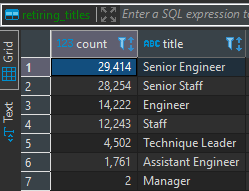
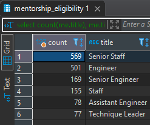
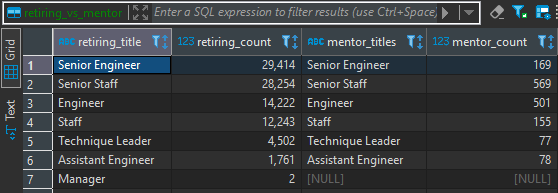

# pewlett-hackard-analysis

## Project Overview
The purpose of this project was to provide an analysis of potentially upcoming retirees so Pewlett Hackard can prepare.

## Results

- There are ***90,398*** employees currently eligible for retirement, and ***1,549*** employees eligible to become mentors.

- There are *seven* titles with retirement-ready employees:
    - Senior Engineer
    - Senior Staff
    - Engineer
    - Staff
    - Technique Leader
    - Assistant Engineer
    - Manager
    

- There are *six* titles with employees eligible to be mentors:
    - Senior Staff
    - Engineer
    - Senior Engineer
    - Staff
    - Assistant Engineer
    - Technique Leader

- The titles with highest number of potential retirees all have eligible mentors available.

## Summary
- There will be ***90,398*** positions to fill as employees begin retiring.

- The amount of eligible mentors is only about 1.71% of the number of retiring employees, so there likely won't be enough mentors available. 

### **Extra Analysis Tables**

#### Counts of Eligible Mentors by Title

#### A comparison of retiring employees vs eligible mentors by title

